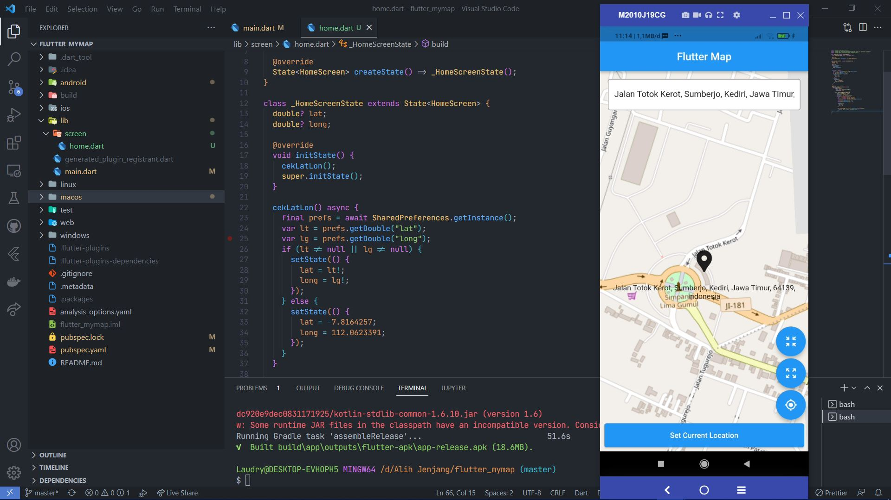
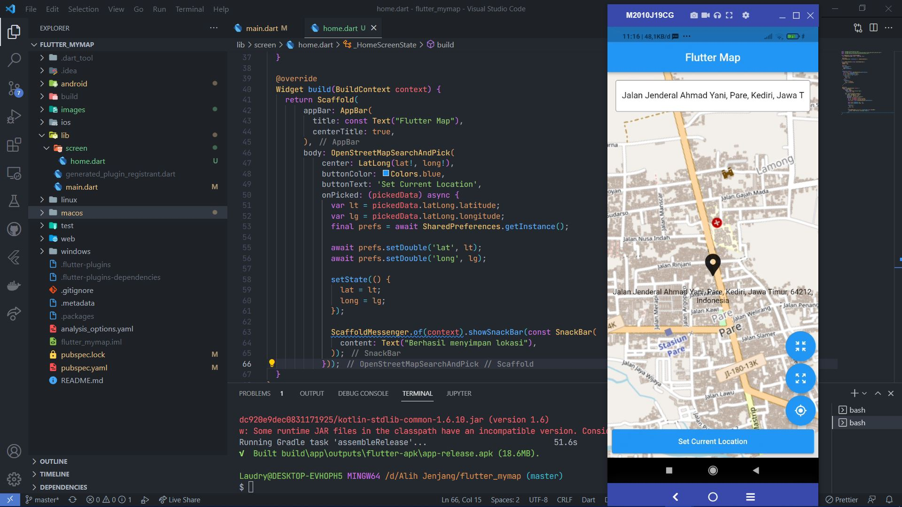

# flutter_mymap

Flutter Map

## Func Cek Lokasi Tersimpan

Jika ada latlong tersimpan di sharepreference maka akan ditampilkan. jika belum ada nanti akan di tampilkan lokasi default yang tertera pada kondisi else.

## Menampilkan Map dan set lokasi

pada onpick akan menyimpan latlong value kedalam sharepreference dan mengganti variable lokasi saat ini. serta menampilkan snackbar.